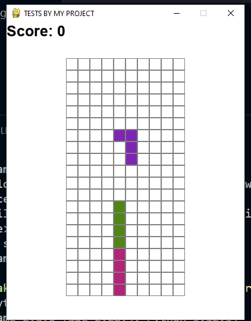

## 📝INSTALLATION

To run the game, you'll need to have Python installed on your system along with the Pygame library. Follow these steps to set up the environment:

Clone the repository (if applicable):<br/>

```bash
git clone https://github.com/yourusername/tetris-python.git
```
cd tetris-python<br/>
```bash
pip Install Pygame:<br/>
```


pip install pygame
How to Run<br/>
Once Pygame is installed, you can run the game using the following command:


python tetris.py
The game window will open, and you can start playing immediately!

write in terminal 
```bash
python main.py
```
 

## Tetris Game in Python
This project is a simple implementation of the classic Tetris game using Python and the Pygame library. The game is designed to be lightweight and easy to play, with familiar controls and features that mirror the traditional Tetris experience.





## Features
Random Tetrominoes: The game randomly generates different tetrominoes (Tetris shapes) that the player must arrange to fill rows.
Rotations and Movements: The player can rotate and move tetrominoes left, right, and down using the keyboard arrow keys.
Score System: The game tracks the player's score, which increases with each completed line. Clearing multiple lines at once yields higher scores.
Game Over State: The game ends when there is no space left for new tetrominoes to spawn, at which point the player is prompted to start a new game.
Restart Functionality: Pressing the ESC key allows the player to restart the game at any point.


## Controls
Arrow Keys:
Up: Rotate the tetromino.<br/>
Down: Move the tetromino down faster.<br/>
Left: Move the tetromino to the left.<br/>
Right: Move the tetromino to the right.<br/>
Space Bar: Instantly drop the tetromino to the bottom.<br/>
Escape: Restart the game.


Dependencies
Python 3.x<br/>
Pygame: A set of Python modules designed for writing video games.<br/>
Project Structure<br/>
tetris.py: The main script containing the game logic and Pygame setup.<br/>
Future Improvements<br/>
Add sound effects and music to enhance the gameplay experience.<br/>
Implement different levels with increasing difficulty.<br/>
Add a pause and resume feature.<br/>
Improve the visual design and add more color schemes.<br/>
Contributing<br/>
Feel free to fork this project, submit issues, or contribute by opening pull requests. Contributions are always welcome!<br/>

License
This project is open-source and available under the MIT License. See the LICENSE file for more details.<br/>

